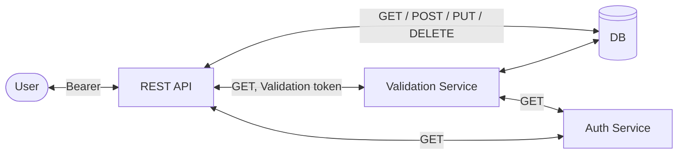

## Run DB conatiner
```sh
docker-compose -f src/main/docker/docker-compose.yml up -d
```

## Stop DB container
```sh
docker-compose -f src/main/docker/docker-compose.yml down
```



## Troubleshooting

### Docker compose

> command not found: docker-compose

Docker app --> Settings --> Advanced

- Uncheck:
  - Allow the default Docker socket to be used (requires password)
  - Allow privileged port mapping (requires password)
- Click "Apply & Restart"

Enable options again:

- Allow the default Docker socket to be used (requires password)
- Allow privileged port mapping (requires password)
- Click "Apply & Restart"

## Migrations

```shell
flyway info -url=jdbc:postgresql://localhost:5432/org_user_db -user=<USER_NAME> -password=<USER_PASSWORD>  

```

```shell
flyway clean -url=jdbc:postgresql://localhost:5432/org_user_db -user=<USER_NAME> -password=<USER_PASSWORD> -cleanDisabled=false
```
